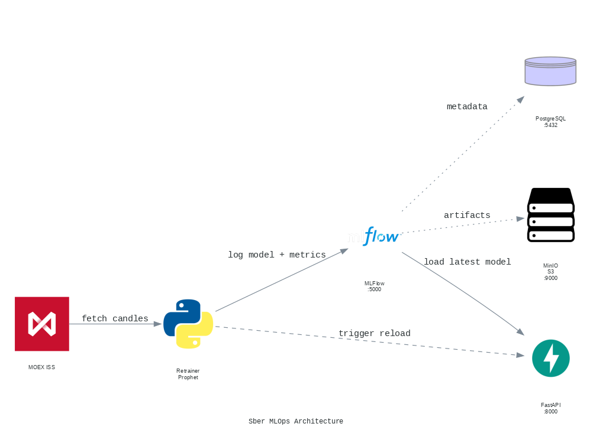

# Stock Prediction MLOps Pipeline

[](https://www.python.org/)
[](https://fastapi.tiangolo.com/)
[](https://mlflow.org/)
[](https://facebook.github.io/prophet/)
[](https://www.docker.com/)
[](https://www.postgresql.org/)
[](https://min.io/)
[](docs/NEOFLEX_PRACTICA.ipynb)
[](LICENSE)


MLOps-стек для прогноза цены акций Сбербанка (SBER) с автоматическим переобучением Prophet-модели, трекингом в MLFlow и REST API на FastAPI.

---

## Архитектура



## Сервисы

| Сервис | Порт | Назначение |
|---|---|---|
| `postgres` | 5432 | БД метаданных MLFlow |
| `minio` | 9000 / 9001 | S3-хранилище артефактов моделей |
| `mlflow` | 5000 | MLFlow Tracking Server |
| `fastapi` | 8000 | REST API для прогнозов |
| `retrainer` | — | Цикл авто-переобучения Prophet |

## Запуск

```bash
docker compose up -d
```

После старта:
- FastAPI: http://localhost:8000
- Swagger: http://localhost:8000/docs
- MLFlow UI: http://localhost:5000
- MinIO Console: http://localhost:9001 (minioadmin / minioadmin)

## API Endpoints

### `GET /`
Информация о сервисе.

### `GET /health`
Статус и источник модели (mlflow / local), дата последнего обучения.

### `POST /predict`
```json
{"days": 5}
```
Прогноз цены SBER на N дней вперёд.

## Jupyter Notebook

В репозитории прилагается [Jupyter Notebook](docs/NEOFLEX_PRACTICA.ipynb) с полным анализом данных:

- Загрузка и визуализация дневных свечей SBER с MOEX ISS API (3 года)
- Обучение Prophet baseline и подбор гиперпараметров через grid search
- Оценка качества (MAE, MAPE) на train/test 80/20
- Сохранение и сравнение моделей
- Экспорт финальной модели для использования в MLOps-пайплайне


## Как это работает

1. **Retrainer** при запуске сразу обучает Prophet на дневных свечах SBER с MOEX ISS API (первая версия в MLFlow). Далее — каждый будний день в **19:00 MSK** (после публикации новой свечи) переобучает модель, считает метрики (MAE, MAPE) и регистрирует новую версию в MLFlow Model Registry.

2. **MLFlow** хранит эксперименты и метрики в PostgreSQL, артефакты моделей  — в MinIO S3.

3. **FastAPI** при старте загружает последнюю модель из MLFlow. Если MLFlow недоступен - локальную модель из `mlflow_artifacts/`.

4. После регистрации новой версии retrainer дёргает `POST /_reload` на FastAPI — модель подхватывается без перезапуска контейнера.


